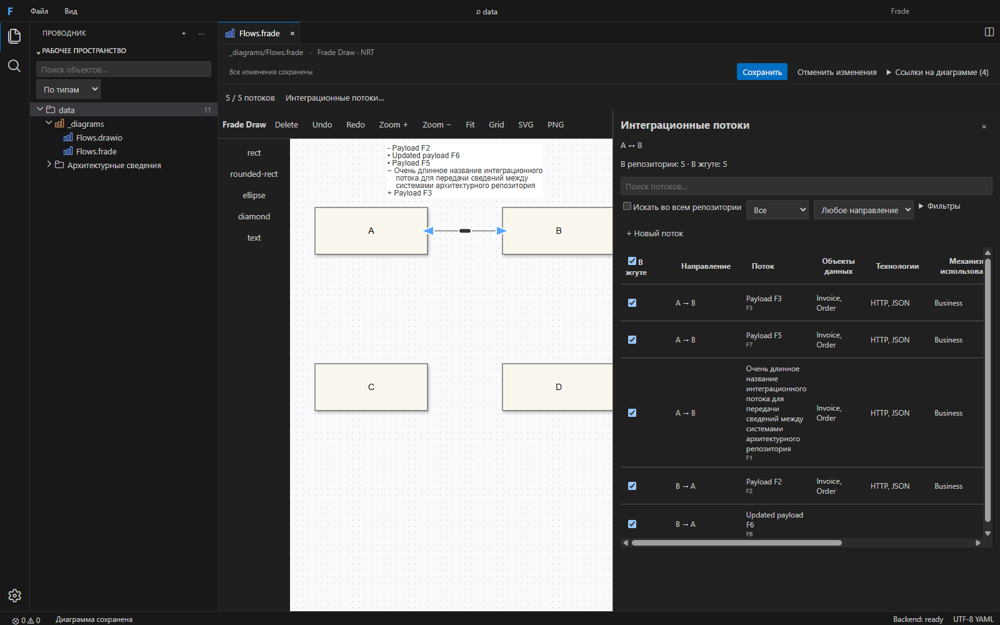
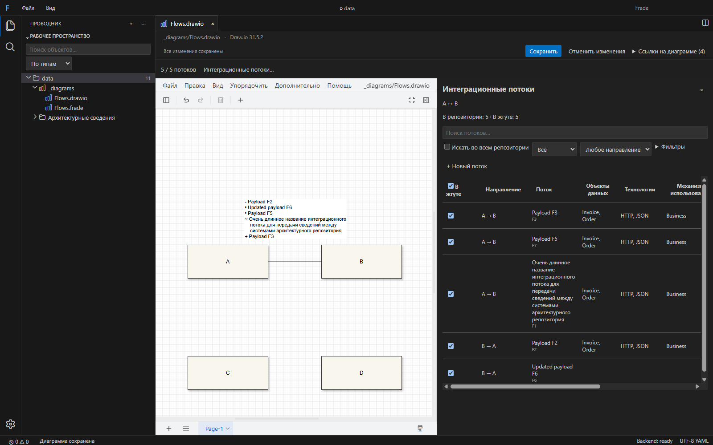

# Интеграционные потоки в жгутах

Реализация проходит через рабочий интерфейс KA Workbench, Domain, Repo Core и адаптер. Общий Flow Manager работает в Frade Draw (.frade) и встроенном Draw.io (.drawio). Интеграционный поток — объект репозитория; состав жгута — данные файла диаграммы. Эти агрегаты сохраняются и отменяются независимо.

## Использование

Создайте связь между двумя системами. Подсказка показывает число найденных потоков: «Выбрать» открывает таблицу, «Создать» — форму. Для существующего жгута доступны двойной щелчок, контекстное меню «Интеграционные потоки…» и действие выбранного жгута. Менеджер расположен справа; его граница перемещается мышью или клавиатурой. Навигатор и канвас остаются доступными. В Draw.io штатные панели фигур/формата временно скрываются и восстанавливаются при закрытии менеджера.

Флажки меняют состав жгута. Щелчок по строке или Enter открывает все свойства; Space переключает флажок. Направление показано текстом и доступно в описании строки и флажка. Поиск, направление, включённость, дополнительные поля и заголовки столбцов управляют выборкой. Общий флажок изменяет только показанную страницу (до 50 строк) одним действием. Esc закрывает текущую форму/свойства либо очищает поисковый слой. Несохранённая форма требует явного отказа от изменений.

В расширенном поиске видны потоки всего репозитория. Несовместимый поток нельзя включить; причина указана рядом с флажком. Его можно клонировать для текущей пары систем. Удаление строки из состава или удаление жгута никогда не удаляет поток.





## 1. Переиспользованные abstractions

ObjectRef, RepositoryObject, Result и ошибки; RepositorySession с авторизацией, queryObjects, validate, applyChanges, expectedRevision, idempotencyKey и событиями; RepositoryApi, WorkbenchClient и scoped IPC; метамодель, TypePresentation, ObjectInspector и LOV; KA CST writer с lock/journal/stage/atomic replace/recovery; вкладки, dirty/save/discard; X6 History и mxGraph model transactions. Нового файлового или YAML writer в UI нет.

## 2. Новые abstractions

IntegrationFlowCapability и общие FlowQuery/FlowRow/FlowPage в repository-domain; чистые функции eligibility, direction, pair key, membership, reverse, clone и validation; IntegrationFlowService в application; общий FlowManager и useBundleManager; адаптерные мосты для двух живых редакторов; проверяемое integrationFlow-описание типа метамодели. API добавляет scoped operation integrationFlows/query, остальные операции используют существующие команды.

## 3. OpenSpec

Изменение: openspec/changes/bundle-integration-flow-management. Созданы proposal.md, design.md, preflight.md, tasks.md, спецификация в specs и feature-файл в bdd. request.txt сохраняет исходное задание. Все 42 сценария имеют исполняемые привязки; тест проверяет полноту соответствия feature-файлу.

## 4. Domain invariants

Состав содержит только уникальные канонические {repositoryId, objectId}; атрибуты потоков не копируются. Допустима пустая коллекция. Пара A/B неупорядоченная, направление потока сохраняется. Совпадение endpoint строгое: включая repositoryId, без расширения подсистем. Reverse сохраняет ID. Clone получает новый ID и очищает audit/revision/generated и настроенные nonCloneable-поля. Отсутствующие и несовместимые ссылки распознаются отдельно. Удаление membership не вызывает repository delete.

## 5. Pair search и производительность

Application service строит индекс из ограниченных страниц queryObjects (1000 объектов), закреплённых за revision. Имена ссылок разрешаются общей картой, без N+1 getObject. Индекс пары содержит оба направления. Повторные запросы используют кэш; ввод debounced на 250 мс, UI получает максимум 50 строк. События репозитория инвалидируют индекс; параллельное построение разделяется между запросами, устаревшие результаты игнорируются. При смене метамодели service пересоздаётся. Даже кэшированный запрос повторно проверяет доступ к сессии.

Тест 100000 потоков использует настоящий авторизованный Repo Core с paged memory adapter: 101 страница, ноль read/getObject, 50000 подходящих потоков, 50 строк ответа. Ввод после построения не читает источник. Полное первоначальное построение имеет стоимость O(N) и требует памяти для производных карт; события пока вызывают перестроение, а не инкрементальное обновление.

### Контракт capability и query

Пример фрагмента типа метамодели (producer и receiver должны быть объявлены reference attributes этого типа):

```json
{
  "integrationFlow": {
    "status": "status",
    "source": "producer",
    "consumer": "receiver",
    "search": ["description", "payload"],
    "columns": [{ "field": "status", "label": "Статус" }],
    "nonCloneable": ["generatedKey"],
    "editable": ["producer", "receiver", "description", "payload", "status"]
  }
}
```

Scoped RepositoryRequest использует существующие requestId/repositoryId и operation:

```json
{
  "operation": "integrationFlows",
  "payload": {
    "query": {
      "endpointA": { "repositoryId": "repo", "objectId": "A" },
      "endpointB": { "repositoryId": "repo", "objectId": "B" },
      "scope": "PAIR",
      "text": "invoice",
      "direction": "ANY",
      "membership": "ALL",
      "members": [],
      "filters": { "status": "Planned" },
      "sort": "status",
      "descending": false,
      "offset": 0,
      "limit": 50
    }
  }
}
```

Response Result<FlowPage>: items (canonical flow, eligible, direction, display values), total, totalEligible, offset, members (valid/incompatible/missing) и capabilities. Оба endpoints относятся к owning repository. Limit API 1–100, UI 50; sort принимает name, direction и configured columns. Ошибки доступа/закрытия сессии, cancellation, stale revision и invalid input не превращаются в пустую таблицу. Create/update идут отдельными существующими validate/applyChanges commands.

## 6. Persistence

В .frade refs находятся в metadata ребра: bundle.integrationFlowRefs; graphAdapter переводит это в repositoryBundle. В .drawio это JSON в атрибуте fradeIntegrationFlowRefs UserObject. Старый kind:empty / fradeBundle=empty сохранён как совместимый маркер типа жгута; фактическую пустоту определяет число refs. Старые файлы читаются без миграции.

Обычные save/save-all/discard работают через существующие вкладки. Повреждённые Draw.io membership-данные не переписываются молча: менеджер блокирует изменение состава и предлагает явную очистку. Канонические отсутствующие refs остаются видимыми и удаляемыми.

## 7. Undo/Redo и reconnect

Изменение флажка и массовое изменение выполняются одним native batch/model transaction. Служебные tools и transient badge не попадают в history или сериализуемый документ. Reconnect сначала проверяет предполагаемую пару; несовместимые refs удаляются только после подтверждения. Cancel восстанавливает связь; один Undo возвращает одновременно endpoints и прежний состав. Состояние ребра и права повторно проверяются перед применением, чтобы отложенный ответ не затёр более свежую правку. Repository mutation имеет отдельный lifecycle и не отменяется diagram Undo.

## 8. Create/Edit/Reverse/Clone

Формы строятся по метамодели и reference LOV. Create валидируется и сохраняется через Repo Core; добавление в жгут включено по умолчанию. Если второй шаг не удался, объект сохраняется, повторяется только membership. Edit использует expectedRevision; конфликт сохраняет черновик и предлагает загрузить актуальную ревизию. Reverse меняет endpoints сначала в черновике, затем обновляет тот же объект. Clone очищает служебные поля и создаёт новый объект; для чужой пары endpoints заменяются на A/B. Edit, меняющий endpoints текущего включённого потока, предупреждает и исключает его только из текущего жгута после успешного сохранения. Закрытые диаграммы автоматически не переписываются.

KA создание расширяет существующий односоставный writer: первая по сортировке сохраняемая коллекция нужного типа; при отсутствии — разрешённый entry/root файл. Сохраняются CST, комментарии, revision checks и recovery. Объект не создаётся в произвольном файле на стороне UI.

## 9. Extended search

Scope ALL охватывает текущий репозиторий. Совместимые потоки получают приоритет; далее учитывается точное/префиксное совпадение ID и имени. Поддерживаются текст, направление, включённость, configured columns, сортировка и страницы. Поля producer/consumer или source/consumer не зашиты в UI: capability назначает роли. Native и импортированные метамодели проверяют корректность ролей и reference constraints. Отсутствие capability объясняется в UI и отключает создание.

## 10. Тесты

Добавлены domain tests; метамодельные и import-validation tests; service tests, включая настоящий Core с 100000 потоков и сортировку configured columns; API access/contracts; KA canonical create/CST/ID/read-only tests; diagram roundtrip/invalid metadata tests; component tests; 42 BDD привязки и дополнительные проверки полноты, конфликтов и dirty guards.

Два реальных Electron теста выполняют восемь journeys каждый: discover/include/save; exclude/Undo/Redo; create; edit; reverse; extended clone; missing ref; native reconnect Cancel/Confirm/Undo/Redo. Дополнительно проверяются Space/focus, bulk одним Undo и независимость удаления жгута от объектов репозитория. Fixture создаёт отдельные временные репозитории и профиль; исходный KA не изменяется.

RED evidence для domain и query сохранено. sort-red.txt фиксирует поведенческий RED для новой сортировки. Первый create-red.txt содержит ошибку синтаксиса теста и не является доказательством поведенческого RED; он сохранён как create-test-syntax-failure.txt. GREEN и регрессионные проверки фактической записи выполнены отдельно.

## 11. Gates

Проверено 26 сентября 2026:

- pnpm check — PASS: lint, typecheck, unit/component, BDD, contracts, build и все architecture boundaries.
- UI workspace — 69 тестов; отдельный BDD gate — 45 тестов (42 сценария + полнота привязок + конфликты + dirty guards).
- KA adapter — 50 тестов; 100000-flow real-Core тест прошёл (первичное построение около 6,1 с в полном прогоне).
- pnpm test:e2e — 214 Draw regression тестов PASS.
- pnpm --filter @frade/desktop test:e2e — 21 Electron regression тест PASS.
- После последних правок подписи, доступности и защиты reconnect: целевой playwright test bundle-flows.spec.ts — 2 теста PASS, 8 journeys в каждом редакторе, 39 с.
- pnpm format:check — PASS.
- openspec validate bundle-integration-flow-management --strict — PASS.
- Оба актуальных screenshot просмотрены; подпись Frade поднята над ручкой линии, Draw.io canvas остаётся видимым рядом с менеджером.

Логи: final-check.txt, final-flows-electron.txt, final-format.txt, final-openspec.txt, draw-regression.txt и desktop-regression.txt в папке OpenSpec change. Полные регрессии выполнены до последних локальных визуальных правок; актуальная версия проверена общим gate и целевым реальным Electron прогоном.

## 12. Assumptions

Целевой жгут связывает два объекта текущего репозитория с каноническими refs. Внешний каталог без такого identity не подменяется локальным объектом. Источник истины для схемы и ролей — подключённая метамодель. ID вводится по ограничениям адаптера/метамодели; UUID используется только там, где он разрешён. Bulk означает текущую страницу, что явно написано в интерфейсе. В legacy XML/JSON маркер empty обозначает тип, а не число членов. Стратегия KA creation выбрана детерминированно и не добавляет отдельного диалога выбора физического файла.

## 13. Ограничения и риски

Полная совместимость diagram refs с нативным Draw.io обеспечивается custom metadata; [официальное описание metadata](https://www.drawio.com/docs/manual/shapes/shape-metadata/). В standalone Draw.io refs сохраняются, но Repo Core и Flow Manager доступны только во Frade. Визуальные атрибуты пользователь может редактировать штатно. Работа проверена с встроенной закреплённой версией Draw.io 31.5.2; обновление движка требует bridge E2E.

Глобальное изменение endpoints может сделать ссылки в других диаграммах несовместимыми; они обнаруживаются при следующей загрузке/валидации, без неявной перезаписи. Начальный индекс O(N); дальнейшее ускорение возможно через adapter pushdown/incremental index. Repository read-only и diagram read-only различаются: UI разрешает только операцию, для которой соответствующий агрегат доступен на запись. Никаких нерешённых продуктовых вопросов для текущего объёма не требуется; добавление потоков не создаёт объектов автоматически и не расширяет пару по иерархии.

## Корректировки после проверки интерфейса

Ресайз Навигатора и менеджера удерживает pointer capture и временно защищает iframe прозрачным shield. Отпускание, cancel, потеря capture/focus и движение без нажатых кнопок завершают жест. При отпускании над Навигатором Draw.io получает pointerup и mouseup с исходным ID указателя; его native-панели перестают двигаться.

Текст на связи заменён на список включённых потоков: «• — Используется», «+ — Создается», «~ — Дорабатывается», «- — Удаляется». В подписи после символа показано каноническое имя потока. Каждый поток начинается новой строкой; длинные имена переносятся примерно после 44 символов, продолжение имеет отступ в четыре символа. Неизвестный статус обозначается ?. В capability можно задать status — имя поля жизненного цикла. В старых capability используется configured status column.

Подписи обновляются и у невыбранных жгутов, в NRT и после повторного открытия. Это производное отображение: атрибуты потоков не копируются в diagram membership, Undo не засоряется. Счётчик N/M остаётся в панели менеджера. Список выровнен слева, расположен над связью и не перекрывает фигуры; X6 при необходимости смещает viewport, чтобы верхние строки не обрезались.

Проверки корректировок: pnpm check — PASS; repository-domain 37 тестов, UI workspace 69 тестов, BDD 45 тестов. Два полных Electron lifecycle-теста — PASS, включая обе стороны iframe, все четыре статуса, длинное имя, NRT, reopen и reconnect/Undo. Все 21 desktop-сценарий проверены: 20 прошли в полном прогоне, существующий Draw.io DnD тест один раз пропустил вставку после zoom/scroll и прошёл отдельный повтор на той же сборке. Этот нестабильный запуск не скрыт: corrections-desktop-regression.txt и corrections-desktop-retry.txt сохранены. Форматирование и OpenSpec strict проверены отдельно. При закрытии Flow Manager Draw.io также возвращает жгут в видимую область.

## Прозрачность и перемещение подписей

Фон подписи в обоих редакторах — #FFFFFFAA: alpha 170/255, около 67% непрозрачности. Цвет и непрозрачность самого текста не меняются. Подпись можно перетаскивать мышью за текст или фон; штатная история редактора отменяет и повторяет перемещение одним шагом.

Frade Draw сохраняет ручную геометрию в optional labelPosition (distance и абсолютный offset). Автоматическая расстановка и производные описания потоков остаются временными; само открытие диаграммы не добавляет сохраняемых изменений. В Draw.io положение хранится в штатной mxGeometry, без изменения pinned движка. Обновление статусов и повторное открытие сохраняют ручное положение; read-only диаграммы остаются защищёнными.

Проверено: pnpm check, восемь тестов в двух целевых suites геометрии, все 214 Draw regression-тестов, форматирование и OpenSpec strict — PASS. В первом полном Electron прогоне прошло 20 из 21 тестов; новая проверка Draw.io Undo получила расхождение измерения 4 px. После ожидания восстановления панелей перед измерением оба полных lifecycle-сценария прошли (42,5 с): прозрачный фон, свободное перемещение, один Undo/Redo, NRT, save/reopen и остальные операции с потоками. Исходный сбой сохранён в label-desktop-regression.txt, итог — label-electron-final.txt. Логи остальных проверок имеют префикс label-.

Снимки после ручного перемещения: [Frade Draw](evidence/bundle-flows/frade-label-moved.png), [Draw.io](evidence/bundle-flows/drawio-label-moved.png).

## Независимая маршрутизация и точки Draw.io

Посторонние фигуры исключены из всех вычислений: создание связи, свободный preview, перемещение концов, перетаскивание сегментов и загрузка старых diagram files. Изначальное исправление фильтровало события изменения фигур, но расчёты ещё принимали препятствия; теперь правило действует и на входах самих алгоритмов. Legacy Manhattan маршрутизатор заменяется на независимый orth, готовая floating-геометрия отображается через normal. Ручные вершины не перезаписываются при загрузке и повторном добавлении.

Набор инструментов теперь общий для standalone и Workbench. Удалена поздняя установка крупных стрелок, заменявшая segment tools. По Draw.io 31.5.2 classic: точки сегментов радиусом 5 px, кольца плавающих концов 6/7 px, заливка #29b6f2, белый контур; выделение #00a8ff, пунктир толщиной 1 px. Курсор всегда соответствует перпендикулярной оси движения. Реальная линия следует каждому отсчёту мыши без прилипания к сетке или посторонним фигурам; начальная точка захвата сохраняется. Undo отменяет геометрию и constraints одним шагом, фокус клавиатуры восстанавливается после жеста.

Встроенный rounded-коннектор X6 округлял координаты изгибов до целых пикселей: при дробных координатах контура линия отклонялась от мыши на 0,5 px. Коннектор frade-rounded сохраняет дробные координаты, оставляя прежние скругления. Реальный Electron-сценарий проверяет положение SVG на каждом перемещении и один шаг Undo/Redo.

Проверки исправления (26.09.2026): pnpm check — PASS; 218 unit-тестов Draw; 215 браузерных сценариев — PASS; оба полных Electron-сценария .frade/.drawio — PASS. Дополнительно проверены реальное движение сегмента через сторонние системы, кольца/точки, один шаг Undo/Redo, сохранение и повторное открытие. Скриншот: evidence/bundle-flows/frade-routing-points.png.
